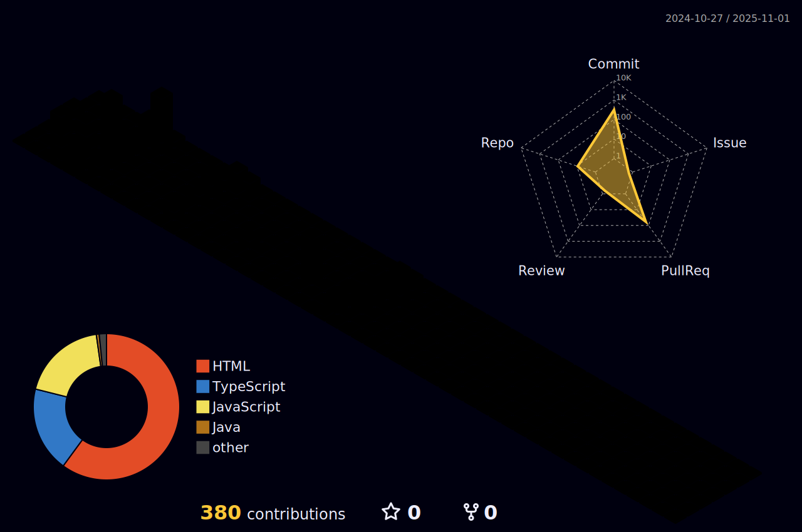

  
  

  
 |  |  |  
 | ----------- | ----------- |

  
## Main Skills

  

   
  

 
 
   

     
  

<picture align="center">
  <source media="(prefers-color-scheme: dark)" srcset="https://raw.githubusercontent.com/wildyhunter/wildyhunter/output/github-contribution-grid-snake-dark.svg">
  <source media="(prefers-color-scheme: light)" srcset="https://raw.githubusercontent.com/wildyhunter/wildyhunter/output/github-contribution-grid-snake-dark.svg">
  
</picture>

